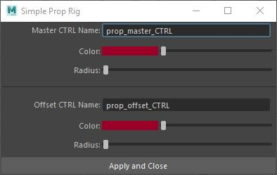
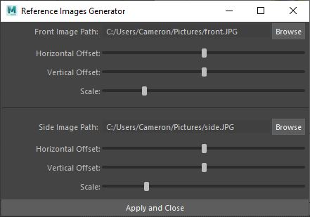

    <h1> Scripts </h1>
    <h3><b>Tools:</b></h3>
    <ul>
        <li><a href="#-ct-prop-rig-generator">CT Simple Prop Rig</a></li>
        <li><a href="#-ct-reference-images-setup">CT Reference Images</a></li>
    </ul>

    <!-- CT Prop Rig Generator -->
    <h1> CT Prop Rig Generator</h1>
    
    
This script generates the industry standard's prop rig for you Helpful for artists who want to skip the repetitive task 
    of making your model <b>production ready</b>, which includes master/offset controllers, parenting hierarchy, and coloring/naming.

    
<b>Important Note: </b> The controllers are centered around your prop's pivot point

    
<b>How to use it:</b>
     1. Select the model you want to rig
     2. Make sure the model's pivot point is placed where you want the controllers to be centered
     3. Run Script
     4. Customize your controllers in the pop-up window
     5. Click on the "Apply and Close" button when done with customization

    
<b>Master CTRL Name: </b> Text field to name the master controller. Will execute after clicking "Apply and Close"

    
<b>Color: </b> Color index slider to interactively change the color of the controller

    
<b>Radius: </b> Float slider to interactively change the radius of the controller

    
<b>Offset CTRL Name: </b> Text field to name the offset controller. Will execute after clicking "Apply and Close"

    
<b>"Apply and Close" button: </b>
     a) Makes the master controller parent of offset
     b) Places model in a "geo" group, as a level of abstraction (in case the model ever changes)
     c) Makes the offset controller parent of the "geo" group 

     
    <!-- CT Reference Images Setup -->
    <h1> CT Reference Images Setup</h1>
    
    
This script generates an interface that will simplify your reference image setup to a few clicks.  Helpful for Maya artists who want to quickly setup their reference images and make them aligned, grouped, and in a reference layer.

    
<b>Important Note:</b> Currently only available for Windows.

    
<b>How to use it:</b>
     1. Run Script
     2. Choose your Front and Side reference images(jpg or png)
     3. Adjust the images with the sliders to make them aligned where you want them
     4. Click "Apply and Close"

    
<b>Image Path: </b> By pressing the "Browse" button you will be able to select an .jpg or .png file from your File Explorer.

    
<b>Horizontal Offset: </b> Slider that interactively offsets the image horizontally

    
<b>Vertical Offset: </b> Slider that interactively offsets the image vertically

    
<b>Scale: </b> Slider that interactively scales the image in all dimensions

    
<b>"Apply and Close" button: </b>
     a) Groups the image planes into <code>references</code>
     b) Creates a Reference Layer for the group

     

